---

---

#   Verilog学习

[TOC]


## 语法篇

### 一、基础语法

#### 1逻辑值

逻辑0 ：低电平

逻辑1 ：高电平

逻辑X：未知 有可能是0 也有可能是1

 逻辑Z：高阻态 外部没有激励信号 是一个悬空状态

#### 2进制格式

二进制 ：‘b     4'b0101   八进制 ：’o  十进制 ：‘d	 4'd2   十六进制：‘h   4'ha

默认位宽32位 默认数据格式十进制

16‘b1001_1010_1001_1010=16'h9a9a

#### 3标识符

标识符可以是字母 数字 $ _ 的组合

第一个字符必须是字母或者下划线

标识符区别大小写

推荐写法：

​	不建议大小写混用

​	普通内部信号建议全部小写

​	信号命名最好体现信号含义 ，简洁清晰易懂

#### 4数据类型

##### 寄存器 

​	抽象的数据存储单元 通过赋值语句改变寄存器存储的值

​	关键字 reg 默认初始值x

```verilog
reg[31:0] delay_cnt;
reg key_reg;
```

reg类型只能在always语句和initial语句中被赋值

如果该过程语句描述的时序逻辑，即always带有时钟信号，则该寄存器变量对应为触发器

如果该过程语句描述的组合逻辑，即always不带有时钟信号，则该寄存器变量对应为硬件连线

##### 线网

​	线网数据类型表嗾使结构实体（例如门）之间的物理连线

​	线网类型不能存储值，它的值有驱动他的元件所决定

​	驱动线网类型变量的元件有门，连续赋值语句，assign等

​	没有驱动元件连接到线网类型的变量上，则该变量就是高阻，即其值为z

​	线网数据类型包括wire和tri，常用的为wire

​	

```verilog
wire[2:0] key_flag
```

##### 参数  

​	参数就是一个常量 在Verilog中用parameter定义常量

​	可以一次定义多个参数，参数与参数之间需要用逗号隔开

​	每个参数定义的右边必须是一个常数表达式

```verilog
parameter N=8;
```

​	参数型数据常用于定义状态机的状态、数据位宽和延迟大小

​	采用标识符来代表一个常量可以提高程序的可读性和可维护性

​	在模块调用时，可通过参数传递来改变被调用模块中已定义的参数

#### 5运算符

##### 1算术运算符  +-*/%

##### 2关系预算符

```
> < >= <= == !=
```

##### 3逻辑运算符 

！ &&  ||   

##### 4条件运算符

a?b:c

##### 5位运算符

~ （取反）  &  |   ^ (异或)

位宽不足时高位补0

##### 6移位运算符

<<    >>

用0填补移除的空位

左移增加位宽  右移位宽不加边

##### 7拼接运算符

{，}  如 c={A,B[3:0]} 将A和B的第四位拼接

##### 8优先级

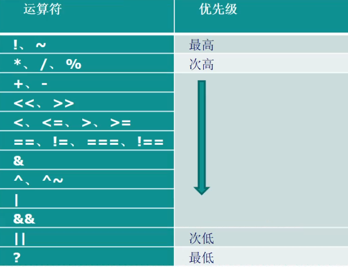

### 二、程序框架

#### 1注释 

//      /*  */

#### 2 关键字

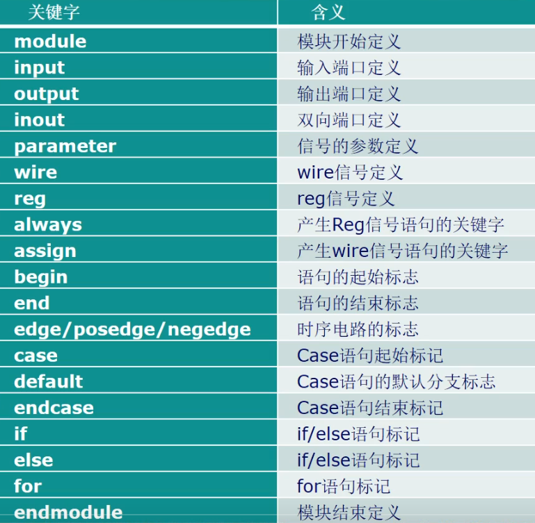

#### 3程序框架

##### 1模块的结构

Verilog的基本设计单元是模块“block”

一个模块是由两部分组成，一部门描述接口 一部分描述逻辑

```verilog
module block(a,b,c,d);
    input a,b;
    output c,d;
    assign c=a|b;
    assign d=a&b;
endmodule
```

每个Verilog程序包括4个主要部分：端口定义 io说明 内部信号声明 功能定义

```verilog
module flow_led(
	input sys_clk,//系统时钟
	input sys_rst,//系统复位
    output reg [3:0] led //4个led灯
);
    reg [23:0] counter;
//******************************************
//******      main code               ******
//******************************************
    always@(posedge sys_clk or negedge sys_rst)
    begin
        if(!sys_rst)
            counter<=0;
        else if(counter <24'd100_0000)
            counter<=counter+1;
        else
            counter<=0;
    end
    //通过移位寄存器控制IO电平高低 从而改变LED显示状态
    always@(posedge sys_clk or negedge sys_rst)
        begin
        if(!sys_rst)
            led<=4'b0001;
        else if(counter==24'd100_0000)
            led[3:0]<={led[2:0],led[3]};
        else
            led<=led;
    end
endmodule
                
```

功能定义部分有三种方法：

1 assign语句 描述组合逻辑

2 always语句 描述组合、时序逻辑

3例化实例元件 如 and#2 u1(q,a,b)

上述三种逻辑功能是**并行**的

**注意：在always语句中，逻辑是顺序执行的 而多个always块之间是并行的**

##### 2模块的调用

在模块调用时，模块通过模块端口在模块之间传递

```verilog
module seg_led_statio_top(
	input sys_clk,//系统时钟
    input sys_rst，//系统复位
    output [5:0] sel,//数码管位选
    output [7:0] seg_led //数码管段选
);
//parameter define 
parameter TIME_SHOW=25'd25000_000
//wire define
wire add_flag;//数码管变化的通知信号
//******************************************
//******      main code               ******
//******************************************
time_count #（
    .MAX_NUM (TIME_SHOW))
  	u_time_count（
    .clk (sys_clk),
    .rst (sys_rst),
    .flag (add_flag)
    );
endmodule
module time_count(
	input clk,
    input rst,
    output reg flag
);
parameter MAX_NUM=50000_000;
//reg define
    reg [24:0] cnt;
```

另一种端口连接方式：

```verilog
time_count #（
    .MAX_NUM (TIME_SHOW))
  	u_time_count（
    sys_clk,
    sys_rst,
    add_flag
    );
```

**模块输入端 可以连接到wire/reg  模块输出端必须连接到wire**

### 三 语句

#### 1结构语句

##### initial

initial语句它在模块中只执行一次

它常用于测试文件的编写 用来产生仿真测试信号（激励信号），或者用于对存储器变量赋初值

```verilog
initial begin
	sys_clk <=1'b0;
	sys_rst <=1'b0;
	touch_key <=1'b0;
    //#表示延时xx个单位的延时 每个#后都代表再原延时的基础上再延时
	#20 sys_rst <=1'b1;
	#10 touch_key=1'b0;
	#30 touch_key=1'b1;
	#110 touch_key=1'b1;
	#30 touch_key=1'b0;
end
```

##### always

always语句一直活在不断的重复活动

但是只有和一定的时间控制结合在一起才有作用

```verilog
always #10 sys_clk<=~sys_clk;
```

always的时间控制可以是沿触发，也可以是电平触发 ；可以是单个信号，也可以是多个信号，多个信号中间要用关键字or连接。

always语句紧跟的过程块是否运行，要看它的触发条件是否满足。

```verilog
    always@(posedge sys_clk or negedge sys_rst)
    begin
        if(!sys_rst)
            counter<=0;
        else if(counter <24'd100_0000)
            counter<=counter+1;
        else
            counter<=0;
    end
```

沿触发的always块常常描述为时序逻辑行为

由关键词or连接的多个事件名或者信号名组成的列表常称为“敏感列表”。

电平触发的always块常用来描述组合逻辑行为

```verilog
always @(a or b or c or d or e or e or f or q or h or m )begin
	out1=a?(b+c):(d+e);
	out2=f?(g+h):(p+m);
end
```

如果组合逻辑块语句的输入变量很多，那么编写敏感列表会很繁琐且容易出错

```verilog
always @(*) begin
	out1=a?(b+c):(d+e);
	out2=f?(g+h):(p+m);
end
```

#### 2赋值语句

##### 阻塞赋值

阻塞赋值可以认为只有一个步骤的操作。计算等号右边并更新等号左边（一个功能）

所谓的阻塞概念是指，在同一个always块中，后面的赋值语句是在前一句赋值语句结束后才开始赋值的。

##### 非阻塞赋值

非阻塞赋值的操作可以看做两个步骤：

​	赋值开始的时候，计算等号右边表达式

​	赋值结束的时候，更新等号左边的值

所谓非阻塞赋值的概念是指，在计算非阻塞赋值等号右边表达式的值以及更新等号左边变量值的时候，允许娶她非阻塞赋值语句同时计算等号右边表达式的值和更新等号左边的值。

非阻塞赋值只能用于对寄存器类型的变量进行赋值，因此只能用于initial和always等过程块中。

**在描述组合逻辑的always块中用阻塞赋值=，综合成组合逻辑的电路结构。**这种电路结构只与输入电平的变化有关系。

**在描述时序逻辑的always块中用非阻塞赋值<=,综合成时序逻辑的电路结构。**这种结构往往与触发沿有关系，只有在触发沿是才可能发生赋值的变化。

**注意：在同一个always块中不要既用非阻塞赋值又用阻塞赋值。**

​			**不允许在多个always块中对同一个变量进行赋值。**

#### 3条件语句

##### if_else语句

if

if.....else

if....else if.....else if ....else

条件语句必须在过程块语句（由initial和always语句引导的块语句）中使用。

**0,x,z按照假处理  1按照真处理**

##### case语句

1 分支表达式值互不相同

2 所有表达式位宽必须相等

3 casez比较时，不考虑表达式中的高阻值

4 casex不考虑高阻值z和casex

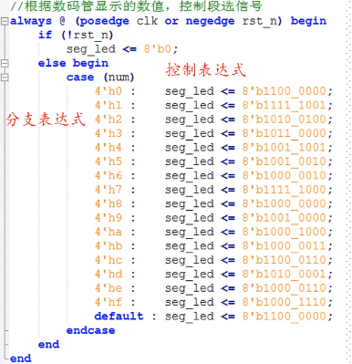

### 四状态机

#### 1状态机概念

状态机（State Machine）有限状态机(Finite State Machine/FSM)：在有限个状态之间按一定规律转换的时序电路

#### 2状态机模型

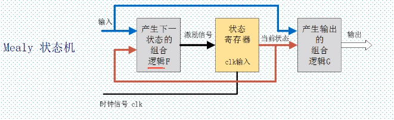

​	**状态寄存器**由一组触发器构成，用来记忆状态机当前所处的状态，状态的改变只发生在时钟的跳变沿

​	状态是否改变，如何改变取决于**组合逻辑F**的输出，F是当前状态和输入信号的函数

​	状态机的输出是由输出**组合逻辑G**提供的，G也是当前状态和输入信号的函数

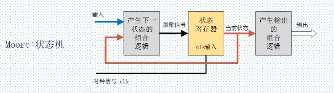

#### 3状态机设计

##### 四段论

###### 状态空间定义

```verilog
//define state space
parameter sleep	=2'b00;
parameter study	=2'b01;
parameter eat	=2'b10;
parameter amuse	=2'b11;
reg[1:0] current_state;
reg[1:0] next_state;
```

```verilog
//define state space
parameter sleep	=4'b1000;
parameter study	=4'b0100;
parameter eat	=4'b0010;
parameter amuse	=4'b0001;
reg[3:0] current_state;
reg[3:0] next_state;
```

独热码：每个状态只有一个寄存器置位，译码逻辑简单

###### 状态跳转（时序逻辑）

```verilog
always@(posedge clk or negedge rst )
    begin
        if(!rst)
            current_state<=sleep;
        else
            current_state<=next_state;//使用非阻塞赋值
    end
```

###### 下个状态判断(组合逻辑)

```verilog
//next sttate decision
always@(current_state or input_signals)//敏感信号表：所有右边表达式变量以及if，case条件中变量
    begin
        case(current_state)
            sleep:begin
                if(clock_arm)
                    next_state=study;
                else
                    next_state=sleep;//使用组合逻辑  阻塞赋值
            end
            //if else 要配对 避免latch发生（latch 锁存器 电平触发的存储器）
            study:begin
                if(lunch_time)
                    next_state=eat;
                else
                    next_state=sy=tudy;
            end
            eat：begin
            end
            amuse:begin
            end
            default：begin
            end
        endcase
    end

```

###### 各个状态下的操作

```verilog
//action
wire read_book;
assign read_book=(current_state==study)?1'b1:1'b0;
```

```verilog
always@(current_state) begin
    if(current_state==study)
        read_book=1;
    else
        read_book=0;
end
```

#### 4实例

```verilog
module devide7_fsm(
    //input ports
    input sys_clk,
    input sys_rst,
    //output ports
    output reg clk_devide7
);
    //reg define
    reg[6:0] current_state;
    reg[6:0] next_state;
    //wire define 
    //parameter define 
    WIDTH=1
    //one hot code design 
    parameter S0=7'b0000000;
    parameter S1=7'b0000010;
    parameter S2=7'b0000100;
    parameter S3=7'b0001000;
    parameter S4=7'b0010000;
    parameter S5=7'b0100000;
    parameter S6=7'b1000000;
    always(posedge sys_clk or negedge sys_rst)begin
        if(!sys_rst)
            current_stare<=	S0;
        else
            current_state<=next_state;
    end
    //FSM state Logic
    always @(*) begin 
        case(current_state)
            S0:begin
                next_state=S1;
            end
            S1:begin
                next_state=S2;
            end
            S2:begin
                next_state=S3;
            end
            S3:begin
                next_state=S4;
            end
            S4:begin
                next_state=S5;
            end
            S5:begin
                next_state=S6;
            end
            S6:begin
                next_state=S0;
            end
            default:begin
                next_state=S0;
            end
        endcase
    end
    always(posedge sys_clk or negedge sys_rst)begin
        if(!sys_rst)begin
            clk_devide7<=1'b0;
        end
        else if（(current_state==S0)|(current_state==S1)|(current_state==S2)|(current_state==S3))
            clk_devide7<=1'b0;
        else if（(current_state==S4)|(current_state==S5)|(current_state==S6))
            clk_devide7<=1'b1;
        else;
    end
endmodule
                
            
            
```

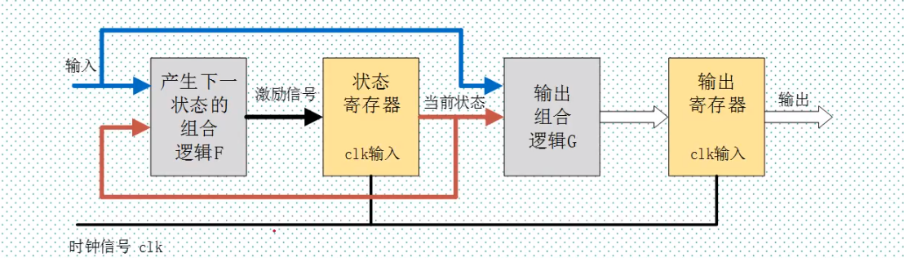

三段式可以在组合逻辑后再增加一级寄存器来实现时序逻辑输出：

1. 可以有效地滤去组合逻辑输出的毛刺
2. 可以有效地进行时序计算与约束
3. 另外对于总线心事的输出信号来说，容易是总线数据对齐，从而减小总线数据间的偏移，减小接收端数据采样出错的频率

## 实战篇--基础外设

### 1流水灯实验

```verilog
module flow_led(
    input sys_clk,
    input sys_rst,
    output reg[3:0] led
);
    reg [23:0] cnt;
    always @(posedge sys_clk or negedge sys_rst)
        begin
            if(!sys_rst)
                cnt<=24'b0000_0000_0000_0000_0000_0000;
            else
                if(cnt<24'd10000000)
                	cnt<=cnt+1;
            	else
                    cnt<=24'b0000_0000_0000_0000_0000_0000;
        end
    always @(posedge sys_clk or negedge sys_rst)
        begin
            if(!sys_rst)
                led<=4'b0001;
            else
                if(cnt==24'd10000000)
                    led<={led[2:0],led[3]};
            	else
                    led<=led;
        end
endmodule
            

```

### 2按键控制LED

```verilog
/*
无按键按下  四个led全灭
按下KEY0   自右向左流水灯
按下key1   自左向右流水灯
按下key2   同时闪烁
按下key3   全亮
*/
module k_led(
	input clk,
    input rst,
    input [3:0] key,
    output reg[3:0] led
);
    //reg define
    reg [23:0] cnt;
    reg [2:0]  led_ctrl;
    // 50m CLK  0.2S计数器
    always @(posedge sys_clk or negedge sys_rst)
        begin
            if(!rst)
                cnt<=24'd0;
            else
                if(cnt<24'd10000000)
                	cnt<=cnt+1;
            	else
                    cnt<=24'b0000_0000_0000_0000_0000_0000;
        end
    //每个0.2s改变状态
    always @(posedge sys_clk or negedge sys_rst)
        begin
            if(!rst)
                led_ctrl<=2'b0;
            else
                if(cnt===24'd10000000)
                	led_ctrl<=led_crtl+1'b1;
            	else
                    led_ctrl<=led_ctrl;
        end
    always @(posedge clk or negedge rst)begin
        if(!rst)
            led<=4'b0000;
    	else
            if(key[0]==1'b0)//按键按下低电平
                case(led_ctrl)
                    2'd0：led<=4'b0001;
                    2'd1：led<=4'b0010;
                    2'd2：led<=4'b0100;
                    2'd3：led<=4'b1000;
                endcase
  			else if(key[1]==1'b0)//按键按下低电平
                case(led_ctrl)
                    2'd0：led<=4'b1000;
                    2'd1：led<=4'b0100;
                    2'd2：led<=4'b0010;
                    2'd3：led<=4'b0001;
                endcase
    		else if(key[1]=1'b0)
                case(led_ctrl)
                    2'd0：led<=4'b1111;
                    2'd1：led<=4'b0000;
                    2'd2：led<=4'b1111;
                    2'd3：led<=4'b0000;
                endcase
    		else if(key[3]==1'b0)
                led<=4'b1111;
    		else
                led<=4'b0000;
    end
endmodule

```

### 3按键控制蜂鸣器

蜂鸣器 引脚长为正极

#### 按键抖动

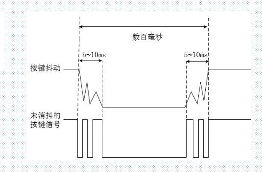

#### 按键消抖

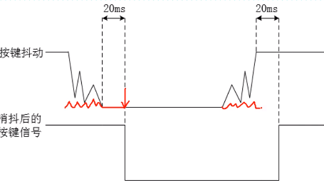

top.v

```verilog
//top
module top_key_beep(
    input            clk,
    input            rst,
    input            key,
    output           beep
    );
    wire key_value;
    wire key_flag;
 key_debounce u_key_debounce(
    .clk        (clk),
    .rst        (rst),
    .key        (key),
    .key_value  (key_value),
    .key_flag  (key_flag)
    );
    beep_control u_beep_control(
    .clk        (clk),
    .rst        (rst),
    .beep       (beep),  
    .key_value  (key_value),
    .key_flag  (key_flag)  
    );
endmodule

```

key_debounce.v

```verilog
module key_debounce(
    input            clk,
    input            rst,
    input            key,
    output  reg     key_value,
    output  reg     key_flag
    );
    reg         key_reg;
    reg [19:0]  delay_cnt;
    always@(posedge clk or negedge rst)
    begin
        if(!rst)
        begin
            key_flag<=1;
            delay_cnt=20'd0;
        end
        else
         begin  
            key_reg<=key;
            if(key!=key_reg)
                delay_cnt<=20'd1000000;
            else begin
                if( delay_cnt>0)
                    delay_cnt<=delay_cnt-1;
                else
                    delay_cnt<=0;
            end
        end
    end
    always @(posedge clk or negedge rst)
    begin
        if(!rst)begin
            key_value<=1'b1;
            key_flag<=1'b0;
        end
        else begin
            if(delay_cnt==20'b1)begin
                key_flag<=1'b1;
                key_value<=key;
            end
            else begin 
                key_flag<=1'b0;
                key_value<=key_value;
            end        
        end
    end
endmodule

```

beep_control.v

```verilog
module beep_control(
    input            clk,
    input            rst,
    input            key_flag,
    input            key_value,
    output reg      beep

    );
always@(posedge clk or negedge rst)
    begin
        if(!rst)
            beep<=1'b1;
        else
            if(key_flag&(~key_value))
                beep<=~beep;
            else
                beep<=beep;
    end
endmodule
```

### 4.触摸按键控制LED

 

```verilog
module touch_led(
	input 		clk,
    input 		rst,
    input 		touch_key,
    output reg 	led
);
    reg 	touch_key_delay0;
    reg 	touch_key_delay1; 
    wire	touch_key_flag;
    assign touch_key_flag=(~touch_key_delay1)&touch_key_delay0;//检测上升沿
    //assign touch_key_flag=(touch_key_delay1)&（~touch_key_delay0）;//检测下降沿
    
    always @(posedge clk or negedge rst)
    begin
        if（!rst）begin
           touch_key_delay0<=0;
           touch_key_delay1<=0;
        end
        else begin
            touch_key_delay0<=touch_key;
            touch_key_delay1<=touch_key_delay0;
        end
    end
    always @(posedge clk or negedge rst)
        begin
            if(!rst)
                led<=1'b1;
            else
                if(touch_key_flag)
                    led<=~led;
            	else
                    led<=led;
        end
            
endmodule
```

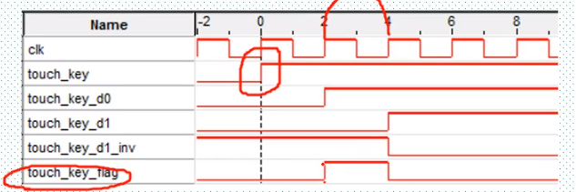

### 5数码管静态显示

  共阴极数码管  1亮  共阳极数码管 0亮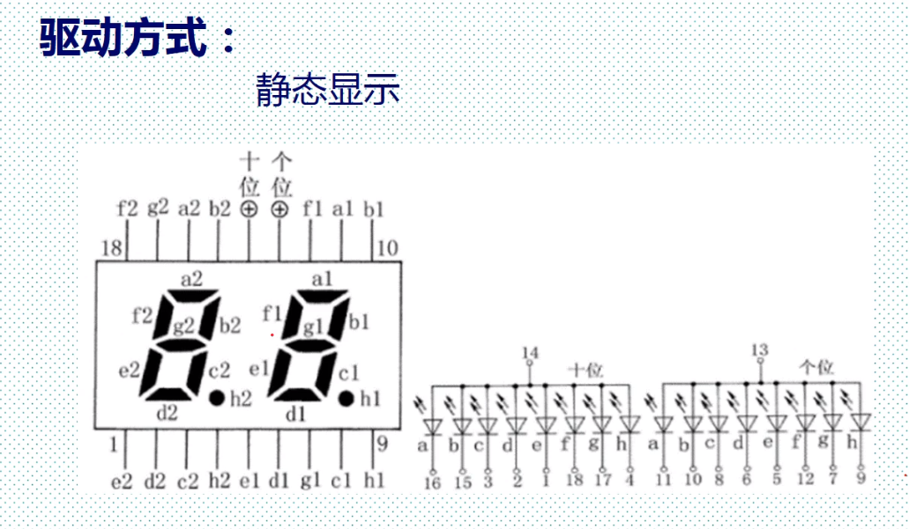

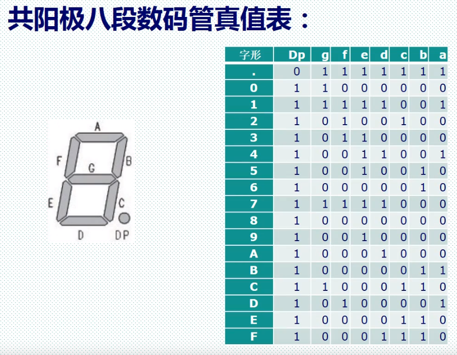

top.v

```verilog
module seg_led_top(
    input clk,
    input rst,
    output [5:0] sel,
    output [7:0] seg
    );
    parameter TIME_SHOW=25'd2500_0000;
    wire add_flag;
    time_count #(.MAX_NUM(TIME_SHOW)) utime_count
    (
        .clk (clk),
        .rst (rst),
        .flag(add_flag)
    );
    seg_led_static u_seg_led_static(
        .clk(clk),
        .rst(rst),
        .add_flag(add_flag),
        .seg(seg),
        .sel(sel)
    );
    
endmodule
```

time_count.v

```verilog
module time_count(
    input clk,
    input rst,
    output reg flag
    );
    //计数器最大计数
    parameter MAX_NUM=25'd25000000;
    //计数器
    reg [24:0]cnt;
    always@(posedge clk or negedge rst)begin
        if(!rst)begin
            flag<=0;
            cnt=25'd0; 
        end
        else begin
            if(cnt<25'd2500_0000)
                cnt<=cnt+1'b1;
            else begin
                cnt<=25'd0;
                flag=1;
                end
            end  
    end
    
endmodule

```

seg_led_static.v

```verilog
module seg_led_static(
    input    clk,
    input    rst,
    input    add_flag,//数码管变化通知信号
    output reg  [ 5:0] sel,//位选信号
    output reg  [ 6:0] seg//段选信号
    );
    reg [3:0] num;//数码管显示的十六进制数
    //静态显示 显示所有数码管
    always@(posedge clk or negedge rst)begin
        if(!rst)
            sel<=6'b111111;
         else 
            sel<=6'b000000;
    end
    always @(posedge clk or negedge rst) begin
        if(!rst)
            num<=4'b0000;
        else if(add_flag) begin
            if(num<4'b1111)
                num<=num+1;
             else
                num<=4'b0000;
        end
        else
            num<=num;
    end
    always@(posedge clk or negedge rst)begin
        if(!rst)
            seg<=8'b00000000;
        else begin 
            case(num)
                4'h0: seg<=8'b1100_0000;
                4'h1: seg<=8'b1111_1001;
                4'h2: seg<=8'b1010_0100;
                4'h3: seg<=8'b1011_0000;
                4'h4: seg<=8'b1001_1001;
                4'h5: seg<=8'b1001_0010;
                4'h6: seg<=8'b1000_0010;
                4'h7: seg<=8'b1111_1000;
                4'h8: seg<=8'b1000_0000;
                4'h9: seg<=8'b1001_0000;
                4'ha: seg<=8'b1000_1000;
                4'hb: seg<=8'b1000_0011;
                4'hc: seg<=8'b1100_0110;
                4'hd: seg<=8'b1010_0001;
                4'he: seg<=8'b1000_0110;
                4'hf: seg<=8'b1000_1110;
                default: seg<=8'b1100_0000;
                
            endcase
        end
    end
endmodule
```

### 6数码管动态显示

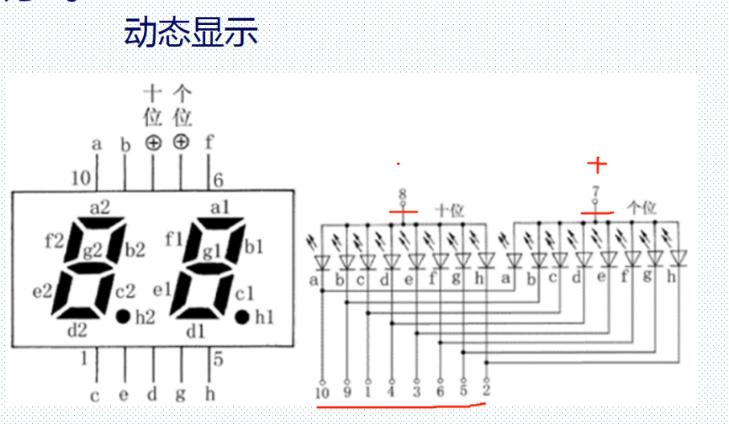

top.v

```
module top_seg_led(
	input 			sys_clk,
	input 			sys_rst,
	output [5:0]	seg_sel,
	output [7:0]	seg_led
);
wire [19:0] data;
wire [5:0] 	point;
wire 		en;
wire		sign;

count u_count(
	.clk 	(sys_clk),
	.rst 	(sys_rst),
	.data	(data),
	.point	(point),
	.en		(en),
	.sign	(sign)
);
seg_led u_seg_led(
	.clk 	(sys_clk),
	.rst 	(sys_rst),
	.data	(data),
	.point	(point),
	.en		(en),
	.sign	(sign),
	.seg_led(seg_led),
	.seg_sel(seg_sel)
);

endmodule
```

count.v

```verilog
module count(
	//module clk
	input 				clk,
	input 				rst,
	output 	reg[19:0] 	data,//最大显示数据为999999
	output  reg[5:0]	point,//小数点位置
	output  reg			en,//使能信号
	output	reg 		sign//符号位 高电平时显示负号 低电平时不显示负号
	);
parameter MAX_NUM=23'D5000_000;//计数器最大计数值
reg [22:0] cnt;//计数器 用于计时 10ms
reg 	   flag;//标志信号
//计数器对系统达到10ms技术是，输出一个周期的脉冲信号
always @(posedge clk or negedge rst)begin
	if(!rst)begin
		cnt<=23'b0;
		flag<=1'b0;
	end
	else if(cnt<MAX_NUM-1,b1) begin
		cnt<=cnt+1'b1;
		flag<=1'b0;
	end
	else begin
		cnt<=23'b0;
		flag<=1'b1;
	end
end

always @(posedge clk or negedge rst)begin
		if(!rst)begin
			data<=20'b0;
			en<=1'b0;
			sign<=1'b0;
			point<=6'b000000;
		end
		else begin
			sign<=1'b0;
			point<=6'b000000;
			if(flag)begin
				if(data<20'd999999)
					data<=data_1'b1;
				else
					data<=20'b0;
			end
		end
end
endmodule
```

seg_leg.v

```verilog
module seg_led(
	input 				clk,
	input 				rst,
	input 	[19:0]		data,
	input	[5:0]		point,
	input  				en,
	input 				sign,
	output	reg[5:0]	sel,//段选信号
	output	reg[7:0]	seg_led
);
localparam CLK_DIVIDE=4'd10;//时钟分频系数
localparam MAX_NUM=13'D5000;//对数码管驱动时钟5MHz计数1ms所需要的计数值
reg [3:0]			clk_cnt;//时钟分频户计数器
reg 				dri_clk;//数码管的驱动时钟 5MHz
reg [23:0]			num;//24位BCD码寄存器
reg [12:0]			cnt0;//数码管驱动时钟计数器
reg					flag;//标志信号（标志着cnt0）计数达到1ms
reg [2:0]			cnt_sel;//数码管当前位选计数器
reg					num_disp;//当前数码管显示的数据
reg					dot_disp;//当前数码管显示的小数点

wire [3:0]			data5;//十万位数
wire [3:0]			data4;//万位数
wire [3:0]			data3;//千位数
wire [3:0]			data2;//百位数
wire [3:0]			data1;//十位数
wire [3:0]			data0;//个位数


assign data0=data%4'd10; //个位数
assign data1=data/4'd10%4'd10;//十位数
assign data2=data/7'd100%4'd10;//百位数
assign data3=data/10'd1000%4'd10;//千位数
assign data4=data/14'd10000%4'd10;//万位数
assign data5=data/17'd100000;//万位数

//对系统时钟进行10分频 得到的频率为5MHz的数码管驱动时钟dri_clk
always@(posedge clk or negedge rst) begin
	if(!rst)begin
		clk_cnt<=4'd0;
		dri_clk<=1'b1;
	end
	else if (clk_cnt==CLK_DIVIDE/2-1'b1) begin
		clk_cnt<=4'd0;
		dri_clk<=~dri_clk;
	end
	else begin
		clk_cnt<=clk_cnt+1'b1;
		dri_clk<=dri_clk;
	end
end
//将20位2进制数转换为8421bcd码 （即使用4位二进制表示以一位十进制数）
always@(posedge dri_clk or negedge rst) begin
	if(!rst)
		num<24'b0;
	else begin
		if(data5||point[5]) begin//如果为6位十进制数,则依次给6位数码管赋值
			num[23:20]<=data5;
			num[19:16]<=data4;
			num[15:12]<=data3;
			num[11:8]<=data2;
			num[7:4]<=data1;
			num[3:0]<=data0;
		end
		else begin
			if(data4||point[4]) begin////如果为5位十进制数,则依次给低5位数码管赋值
				num[19:0]<={data4,data3,data2,data1,data0};
				if(sign)
					num[23:20]<=4'd11;//如果需要显示符号位,则最高位位符号位
				else 
					num[23:20]<=4'd10;//如果不需要显示符号位,则最高位不显示
			end
			else begin
				if(data3||point[3]) begin////如果为4位十进制数,则依次给低4位数码管赋值
					num[15:0]<={data3,data2,data1,data0};
					num[23:20]<=4'd10;//第六位不需要显示任何东西
					if(sign)
						num[19:16]<=4'd11;//如果需要显示符号位,则第5位位符号位
					else 
						num[19:16]<=4'd10;//如果不需要显示符号位,则第5位不显示
				end
				else begin
					if(data2||point[2]) begin////如果为3位十进制数,则依次给低3位数码管赋值
						num[11:0]<={data2,data1,data0};
						num[23:16]<={2{4'd10}};//第六 五位不需要显示任何东西
						if(sign)
							num[15:12]<=4'd11;//如果需要显示符号位,则第4位位符号位
						else 
							num[15:12]<=4'd10;//如果不需要显示符号位,则第4位不显示
					else begin
						if(data1||point[1]) begin////如果为2位十进制数,则依次给低2位数码管赋值
							num[7:0]<={data1,data0};
							num[23:12]<={3{4'd10}};//第六 五 四位不需要显示任何东西
							if(sign)
								num[11:8]<=4'd11;//如果需要显示符号位,则第3位位符号位
							else 
								num[11:8]<=4'd10;//如果不需要显示符号位,则第3位不显示
						end
						else begin
							num[3:0]<=data0;
							num[23:8]<{4{4'd10}};
							if(sign)
								num[7:4]<=4'd11;//如果需要显示符号位,则第2位位符号位
							else 
								num[7:4]<=4'd10;//如果不需要显示符号位,则第2位不显示
						end
					end
				end
			end
		end
			
	end
end
//每当计数器对数码驱动时钟技术时间达1ms 输出一个时钟周期的脉冲信号
always@(posedge dri_clk or negedge rst)begin
	if(!rst)begin
		cnt0<=1'b0;
		flag<=1'b0;
	end
	else if(cnt0<MAX_NUM-1'b1)begin
		cnt0<=cnt0+1'b1;
		flag<=flag;
	end
	else begin
		cnt0<=1'b0;
		flag<=1'b1;
	end
end
//cnt_sel从0计数到5 用于选择当前显示状态的数码管
always@(posedge dri_clk or negedge rst)begin
	if(!rst)
		cnt_sel<=3'b0;
	else if(flag) begin
		if(cnt_sel<3'd5) 
			cnt_sel<=cnt_sel+1’b1;
		else
			cnt_sel<1'b0;
	end
	else
		cnt_sel<=cnt_sel;
end
//控制数码管段选信号 使6位数码管轮流显示
always@(posedge dri_clk or negedge rst)begin
	if(!rst) begin
		sel<=6'b111111;
		num_disp<4'b0;
		dot_disp<=1'b1;
	end
	else begin
		if (en ) begin
			case(cnt_sel)
				3'd0:begin
					seg_sel<=6'b111110;
					num_disp<=num[3:0];
					dot_disp<=~point[0];
				end
				3'd1:begin
					seg_sel<=6'b111101;
					num_disp<=num[7:4];
					dot_disp<=~point[1];
				end
				3'd2:begin
					seg_sel<=6'b111011;
					num_disp<=num[11:8];
					dot_disp<=~point[3];
				end
				3'd3:begin
					seg_sel<=6'b110111;
					num_disp<=num[15:12];
					dot_disp<=~point[4];
				end
				3'd4:begin
					seg_sel<=6'b101111;
					num_disp<=num[19:16];
					dot_disp<=~point[5];
				end
				3'd5:begin
					seg_sel<=6'b011111;
					num_disp<=num[23:20];
					dot_disp<=~point[5];
				end
				default:begin
					sel<=6'b111111;
					num_disp<4'b0;
					dot_disp<=1'b1;
				end	
			endcase
		end
		else begin
			sel<=6'b111111;
			num_disp<4'b0;
			dot_disp<=1'b1;
		end
	end
end
//数码管控制段选信号 显示字符
always@(posedge dri_clk or negedge rst)begin
	if(!rst)
		seg_led<=8'hc0;
	else begin
		case(nump_disp)
			4'd0:seg_led<={dot_disp,7'b1000000};//显示数字0
			4'd1:seg_led<={dot_disp,7'b1111001};//显示数字1
			4'd2:seg_led<={dot_disp,7'b0100100};//显示数字2
			4'd3:seg_led<={dot_disp,7'b0110000};//显示数字3
			4'd4:seg_led<={dot_disp,7'b0011001};//显示数字4
			4'd5:seg_led<={dot_disp,7'b0010010};//显示数字5
			4'd6:seg_led<={dot_disp,7'b0000010};//显示数字6
			4'd7:seg_led<={dot_disp,7'b1111000};//显示数字7
			4'd8:seg_led<={dot_disp,7'b0000000};//显示数字8
			4'd9:seg_led<={dot_disp,7'b0010000};//显示数字9
			4'd10:seg_led<=8'b11111111;//不显示任何字符
			4'd11:seg_led<=8'b10111111;//显示负号
			
	end
end

endmodule
```

### 7红外遥控实验

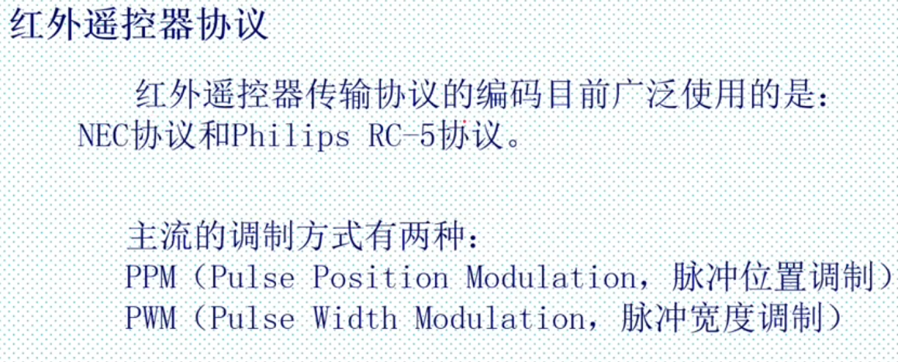

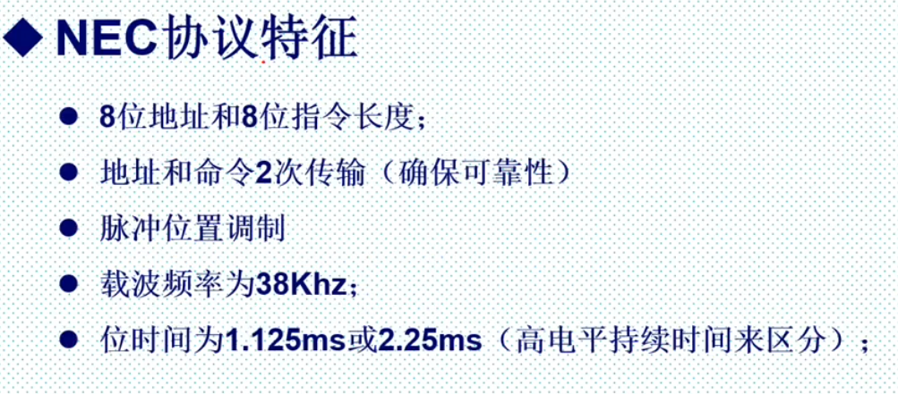

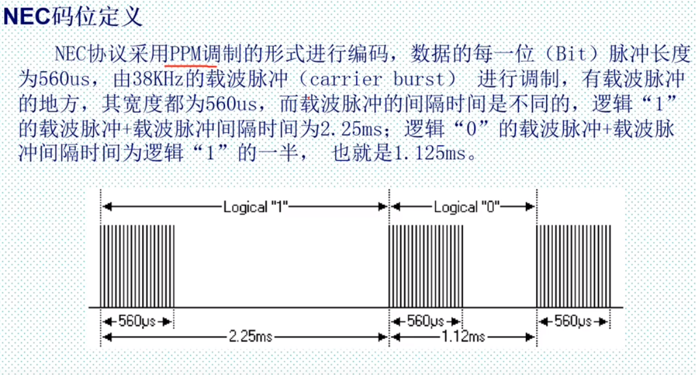

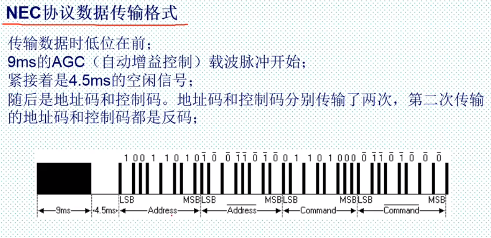

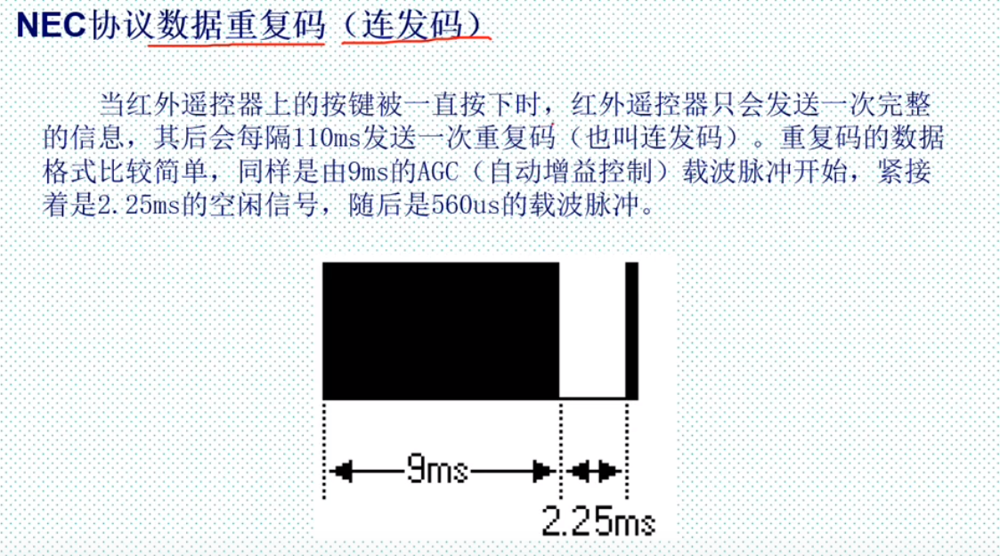

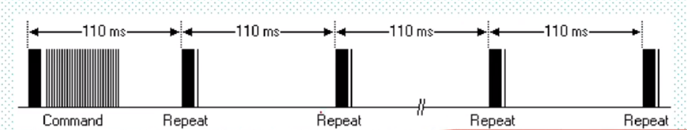

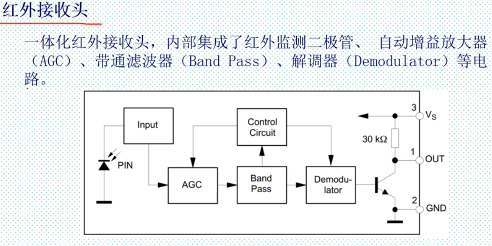

最后接三极管作用电平取反

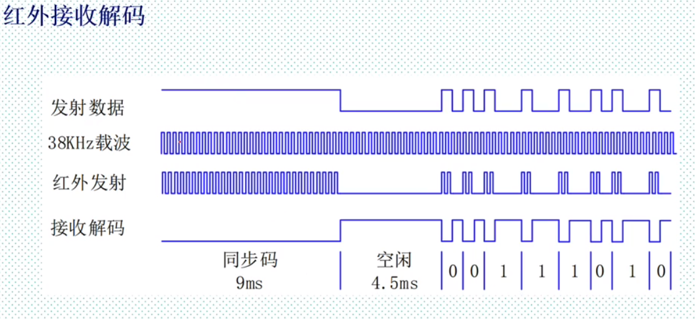

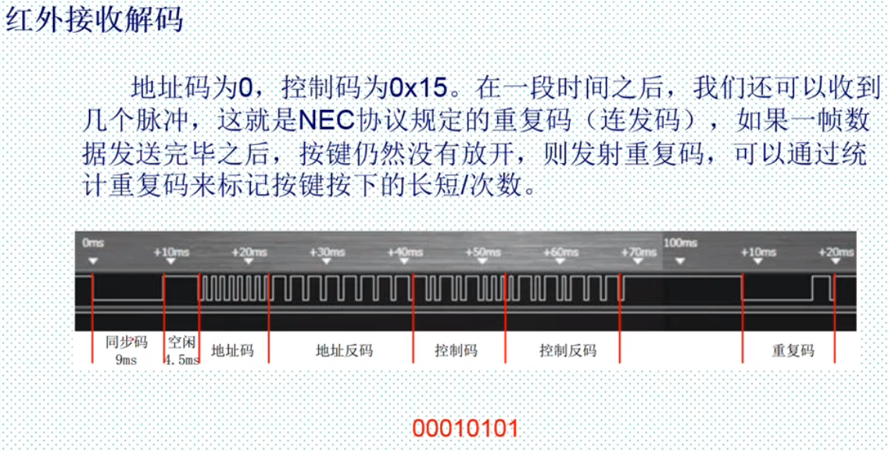

检测遥控器发出的信号，显示，如果有重复码 则闪烁

#### 程序设计

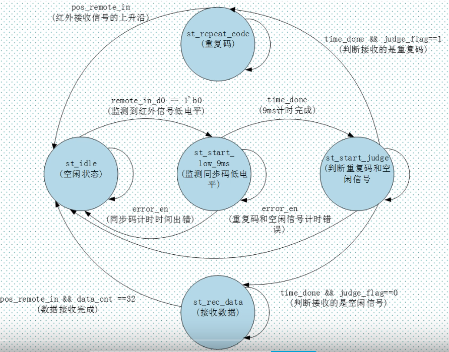

top.v

```verilog
module top_remote_recv(
	input				sys_clk,
	input				sys_rst,
	input				remote_in,//红外接收信号
	output 		[5:0]	sel,//数码管位选信号
	output 		[7:0]	seg_led,//数码管段选信号
	output				led//led灯
);
//wire define
wire 	[7:0]		data;
wire 				repeat_en;
//数码管显示模块
seg_led u_seg_led(
	.clk		(sys_clk),
	.rst		(sys_rst),
	.sel		(sel),
	.seg_led	(seg_led),
	.data		(data),		//红外数据
	.point		(6'd0),		//无小数点
	.en			(1'b1),		//使能数码管
	.sign		(1'b0)		//无符号显示
);
//红外接收模块
remote_rcv u_remote_rcv(
	.sys_clk	(sys_clk),
	.sys_rst	(sys_rst),
	.remote_in	(remote_in),
	.repeat_en	(repeat_en),
	.data_en	(),
	.data		(data)
);
led_ctrl u_led_ctrl(
	.sys_clk	(sys_clk),
	.sys_rst	(sys_rst),
	.repeat_en	(repeat_en),
	.led		(led)
);
endmodule

```

remote_rcv.v

```verilog
module remote_rcv(
	input 				sys_clk,//时钟信号
	input 				sys_rst,//复位信号
	input				remote_in,//红外接收信号
	output 	reg			repeat_en,//重复码有效信号
	output	reg			data_en,//数据有效信号
	output	reg[7:0]	data//红外控制码	
);
//parameter define
 parameter	 st_idle	=5'b00001;//空闲状态
 parameter	 st_start_low_9ms=5'b00010;//检测同步码低电平
 parameter 	 st_start_judge=5'b00100;//判断重复码和空闲信号
 parameter   st_rec_data=5'b01000;//接受数据
 parameter	 st_repeat_code=5'b10000;//重复码
 //reg define
 reg	[4:0]		cur_state;
 reg	[4:0]		next_state;
 
 reg	[11:0]		div_cnt;//	分频计数器
 reg				div_clk;//分频时钟
 reg				remote_in_d0;//对输入的红外信号延时打拍
 reg				remote_in_d1;
 reg	[7:0]		time_cnt;//对红外的各个状态进行计数
 
 reg           		time_cnt_clr   ;  //计数器清零信号
reg             	time_done      ;  //计时完成信号
reg             	error_en       ;  //错误信号
reg             	judge_flag     ;  //检测出的标志信号 0:同步码高电平(空闲信号)  1:重复码
reg    	[15:0]   	data_temp      ;  //暂存收到的控制码和控制反码
reg    	[5:0]    	data_cnt       ;  //对接收的数据进行计数   


assign  pos_remote_in = (~remote_in_d1) & remote_in_d0;
assign  neg_remote_in = remote_in_d1 & (~remote_in_d0);

//时钟分频,50Mhz/(2*(3124+1))=8khz,T=0.125ms
always @( posedge sys_clk or negedge sys_rst)	begin
	if(!sys_rst) begin
		div_cnt<=12'd0;
		div_clk<=1'b0;
	end
	else if(div_cnt==12'd3124) begin
		div_cnt<=0;
		div_clk<=~div_clk;
	end
	else
		div_cnt<=div_cnt+1;
end
 
```

led_ctrl.v

```verilog
module led_ctrl(
    input             sys_clk   ,  //系统时钟
    input             sys_rst ,  //系统复位信号，低电平有效
    
    input             repeat_en ,  //重复码触发信号
    output    reg     led          //LED灯
    );

//reg define
reg            repeat_en_d0 ;      //repeat_en信号打拍采沿
reg            repeat_en_d1 ;
reg    [22:0]  led_cnt      ;      //LED灯计数器,用于控制LED灯亮灭

//wire define
wire           pos_repeat_en;

//*****************************************************
//**                    main code
//*****************************************************

assign  pos_repeat_en = ~repeat_en_d1 & repeat_en_d0;

////repeat_en信号打拍采沿
always @(posedge sys_clk or negedge sys_rst) begin
    if(!sys_rst) begin
        repeat_en_d0 <= 1'b0;
        repeat_en_d1 <= 1'b0;
    end
    else begin
        repeat_en_d0 <= repeat_en;
        repeat_en_d1 <= repeat_en_d0;
    end
end    

always @(posedge sys_clk or negedge sys_rst) begin
    if(!sys_rst) begin
        led_cnt <= 23'd0;
        led <= 1'b0;
    end
    else begin
        if(pos_repeat_en) begin
            led_cnt <= 23'd5_000_000;              //单次重复码:亮80ms 灭20ms
            led <= 1'b1;                           //led亮的时间:4_000_000*20ns=80ms
        end   
        else if(led_cnt != 23'd0) begin
            led_cnt <= led_cnt - 23'd1;
            if(led_cnt < 23'd1_000_000)            //led灭的时间:1_000_000*20ns=20ms
                led <= 1'b0;
        end     
    end    
end

endmodule
```

seg_led.v

```verilog
module seg_led(
    input                   clk    ,        // 时钟信号
    input                   rst  ,        // 复位信号

    input         [19:0]    data   ,        // 6位数码管要显示的数值
    input         [5:0]     point  ,        // 小数点具体显示的位置,从高到低,高电平有效
    input                   en     ,        // 数码管使能信号
    input                   sign   ,        // 符号位（高电平显示“-”号）

    output   reg  [5:0]     seg_sel,        // 数码管位选，最左侧数码管为最高位
    output   reg  [7:0]     seg_led         // 数码管段选
    );

//parameter define
localparam  CLK_DIVIDE = 4'd10     ;        // 时钟分频系数
localparam  MAX_NUM    = 13'd5000  ;        // 对数码管驱动时钟(5MHz)计数1ms所需的计数值

//reg define
reg    [ 3:0]             clk_cnt  ;        // 时钟分频计数器
reg                       dri_clk  ;        // 数码管的驱动时钟,5MHz
reg    [23:0]             num      ;        // 24位bcd码寄存器
reg    [12:0]             cnt0     ;        // 数码管驱动时钟计数器
reg                       flag     ;        // 标志信号（标志着cnt0计数达1ms）
reg    [2:0]              cnt_sel  ;        // 数码管位选计数器
reg    [3:0]              num_disp ;        // 当前数码管显示的数据
reg                       dot_disp ;        // 当前数码管显示的小数点

//wire define
wire   [3:0]              data0    ;        // 个位数
wire   [3:0]              data1    ;        // 十位数
wire   [3:0]              data2    ;        // 百位数
wire   [3:0]              data3    ;        // 千位数
wire   [3:0]              data4    ;        // 万位数
wire   [3:0]              data5    ;        // 十万位数

//*****************************************************
//**                    main code
//*****************************************************

//提取显示数值所对应的十进制数的各个位
assign  data0 = data % 4'd10;               // 个位数
assign  data1 = data / 4'd10 % 4'd10   ;    // 十位数
assign  data2 = data / 7'd100 % 4'd10  ;    // 百位数
assign  data3 = data / 10'd1000 % 4'd10 ;   // 千位数
assign  data4 = data / 14'd10000 % 4'd10;   // 万位数
assign  data5 = data / 17'd100000;          // 十万位数

//对系统时钟10分频，得到的频率为5MHz的数码管驱动时钟dri_clk
always @(posedge clk or negedge rst) begin
   if(!rst) begin
       clk_cnt <= 4'd0;
       dri_clk <= 1'b1;
   end
   else if(clk_cnt == CLK_DIVIDE/2 - 1'd1) begin
       clk_cnt <= 4'd0;
       dri_clk <= ~dri_clk;
   end
   else begin
       clk_cnt <= clk_cnt + 1'b1;
       dri_clk <= dri_clk;
   end
end

//将20位2进制数转换为8421bcd码(即使用4位二进制数表示1位十进制数）
always @ (posedge dri_clk or negedge rst) begin
    if (!rst)
        num <= 24'b0;
    else begin
        if (data5 || point[5]) begin     //如果显示数据为6位十进制数，
            num[23:20] <= data5;         //则依次给6位数码管赋值
            num[19:16] <= data4;
            num[15:12] <= data3;
            num[11:8]  <= data2;
            num[ 7:4]  <= data1;
            num[ 3:0]  <= data0;
        end
        else begin                         
            if (data4 || point[4]) begin //如果显示数据为5位十进制数，则给低5位数码管赋值
                num[19:0] <= {data4,data3,data2,data1,data0};
                if(sign)                    
                    num[23:20] <= 4'd11; //如果需要显示负号，则最高位（第6位）为符号位
                else
                    num[23:20] <= 4'd10; //不需要显示负号时，则第6位不显示任何字符
            end
            else begin                   //如果显示数据为4位十进制数，则给低4位数码管赋值
                if (data3 || point[3]) begin
                    num[15: 0] <= {data3,data2,data1,data0};
                    num[23:20] <= 4'd10; //第6位不显示任何字符
                    if(sign)             //如果需要显示负号，则最高位（第5位）为符号位
                        num[19:16] <= 4'd11;
                    else                 //不需要显示负号时，则第5位不显示任何字符
                        num[19:16] <= 4'd10;
                end
                else begin               //如果显示数据为3位十进制数，则给低3位数码管赋值
                    if (data2 || point[2]) begin
                        num[11: 0] <= {data2,data1,data0};
                                         //第6、5位不显示任何字符
                        num[23:16] <= {2{4'd10}};
                        if(sign)         //如果需要显示负号，则最高位（第4位）为符号位
                            num[15:12] <= 4'd11;
                        else             //不需要显示负号时，则第4位不显示任何字符
                            num[15:12] <= 4'd10;
                    end
                    else begin           //如果显示数据为2位十进制数，则给低2位数码管赋值
                        if (data1 || point[1]) begin
                            num[ 7: 0] <= {data1,data0};
                                         //第6、5、4位不显示任何字符
                            num[23:12] <= {3{4'd10}};
                            if(sign)     //如果需要显示负号，则最高位（第3位）为符号位
                                num[11:8]  <= 4'd11;
                            else         //不需要显示负号时，则第3位不显示任何字符
                                num[11:8] <=  4'd10;
                        end
                        else begin       //如果显示数据为1位十进制数，则给最低位数码管赋值
                            num[3:0] <= data0;
                                         //第6、5位不显示任何字符
                            num[23:8] <= {4{4'd10}};
                            if(sign)     //如果需要显示负号，则最高位（第2位）为符号位
                                num[7:4] <= 4'd11;
                            else         //不需要显示负号时，则第2位不显示任何字符
                                num[7:4] <= 4'd10;
                        end
                    end
                end
            end
        end
    end
end

//每当计数器对数码管驱动时钟计数时间达1ms，输出一个时钟周期的脉冲信号
always @ (posedge dri_clk or negedge rst) begin
    if (rst == 1'b0) begin
        cnt0 <= 13'b0;
        flag <= 1'b0;
     end
    else if (cnt0 < MAX_NUM - 1'b1) begin
        cnt0 <= cnt0 + 1'b1;
        flag <= 1'b0;
     end
    else begin
        cnt0 <= 13'b0;
        flag <= 1'b1;
     end
end

//cnt_sel从0计数到5，用于选择当前处于显示状态的数码管
always @ (posedge dri_clk or negedge rst) begin
    if (rst == 1'b0)
        cnt_sel <= 3'b0;
    else if(flag) begin
        if(cnt_sel < 3'd5)
            cnt_sel <= cnt_sel + 1'b1;
        else
            cnt_sel <= 3'b0;
    end
    else
        cnt_sel <= cnt_sel;
end

//控制数码管位选信号，使6位数码管轮流显示
always @ (posedge dri_clk or negedge rst) begin
    if(!rst) begin
        seg_sel  <= 6'b111111;              //位选信号低电平有效
        num_disp <= 4'b0;           
        dot_disp <= 1'b1;                   //共阳极数码管，低电平导通
    end
    else begin
        if(en) begin
            case (cnt_sel)
                3'd0 :begin
                    seg_sel  <= 6'b111110;  //显示数码管最低位
                    num_disp <= num[3:0] ;  //显示的数据
                    dot_disp <= ~point[0];  //显示的小数点
                end
                3'd1 :begin
                    seg_sel  <= 6'b111101;  //显示数码管第1位
                    num_disp <= num[7:4] ;
                    dot_disp <= ~point[1];
                end
                3'd2 :begin
                    seg_sel  <= 6'b111011;  //显示数码管第2位
                    num_disp <= num[11:8];
                    dot_disp <= ~point[2];
                end
                3'd3 :begin
                    seg_sel  <= 6'b110111;  //显示数码管第3位
                    num_disp <= num[15:12];
                    dot_disp <= ~point[3];
                end
                3'd4 :begin
                    seg_sel  <= 6'b101111;  //显示数码管第4位
                    num_disp <= num[19:16];
                    dot_disp <= ~point[4];
                end
                3'd5 :begin
                    seg_sel  <= 6'b011111;  //显示数码管最高位
                    num_disp <= num[23:20];
                    dot_disp <= ~point[5];
                end
                default :begin
                    seg_sel  <= 6'b111111;
                    num_disp <= 4'b0;
                    dot_disp <= 1'b1;
                end
            endcase
        end
        else begin
            seg_sel  <= 6'b111111;          //使能信号为0时，所有数码管均不显示
            num_disp <= 4'b0;
            dot_disp <= 1'b1;
        end
    end
end

//控制数码管段选信号，显示字符
always @ (posedge dri_clk or negedge rst) begin
    if (!rst)
        seg_led <= 8'hc0;
    else begin
        case (num_disp)
            4'd0 : seg_led <= {dot_disp,7'b1000000}; //显示数字 0
            4'd1 : seg_led <= {dot_disp,7'b1111001}; //显示数字 1
            4'd2 : seg_led <= {dot_disp,7'b0100100}; //显示数字 2
            4'd3 : seg_led <= {dot_disp,7'b0110000}; //显示数字 3
            4'd4 : seg_led <= {dot_disp,7'b0011001}; //显示数字 4
            4'd5 : seg_led <= {dot_disp,7'b0010010}; //显示数字 5
            4'd6 : seg_led <= {dot_disp,7'b0000010}; //显示数字 6
            4'd7 : seg_led <= {dot_disp,7'b1111000}; //显示数字 7
            4'd8 : seg_led <= {dot_disp,7'b0000000}; //显示数字 8
            4'd9 : seg_led <= {dot_disp,7'b0010000}; //显示数字 9
            4'd10: seg_led <= 8'b11111111;           //不显示任何字符
            4'd11: seg_led <= 8'b10111111;           //显示负号(-)
            default: 
                   seg_led <= {dot_disp,7'b1000000};
        endcase
    end
end

endmodule 
```

